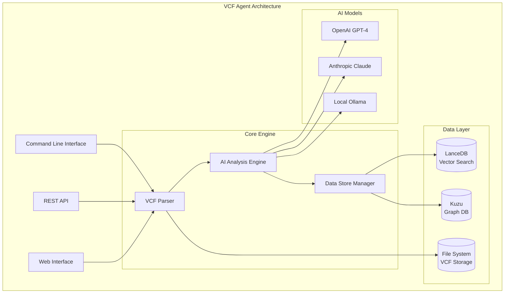

# VCF Analysis Agent

A comprehensive AI-powered tool for analyzing Variant Call Format (VCF) files with advanced genomic insights, dual-database architecture, and production-ready performance.

## 🚀 Key Features

### Core Capabilities
- **AI-Powered Analysis**: Advanced variant interpretation using multiple AI models (OpenAI, Ollama)
- **Dual-Database Architecture**: LanceDB for vector similarity search + Kuzu for graph relationships
- **High Performance**: >10,000 variants/second ingestion, <100ms similarity queries
- **Comprehensive Testing**: End-to-end validation with synthetic and real genomic data
- **Production Ready**: Docker deployment, monitoring, and observability

### Data Processing
- **VCF File Analysis**: Complete VCF parsing and validation
- **Variant Annotation**: Clinical significance, gene associations, and impact analysis
- **Similarity Search**: AI-powered semantic search across variant databases
- **Relationship Modeling**: Complex genomic relationships using graph database
- **Batch Processing**: Optimized for large-scale genomic datasets

### AI Integration
- **Multi-Model Support**: OpenAI GPT-4, Claude, Ollama local models
- **Embedding Generation**: 1536-dimensional variant embeddings for similarity search
- **Intelligent Analysis**: Context-aware variant interpretation and clinical insights
- **Adaptive Reasoning**: Dynamic model selection based on query complexity

## 📊 Architecture Overview



## 🏗️ Data Stores Architecture

The VCF Agent implements a sophisticated dual-database architecture optimized for genomic data:

### LanceDB (Vector Database)
- **Purpose**: Semantic similarity search and AI embeddings
- **Performance**: <100ms query response, 1536-dimensional embeddings
- **Features**: Hybrid search, batch ingestion, metadata filtering

### Kuzu (Graph Database)  
- **Purpose**: Complex genomic relationships and network analysis
- **Performance**: <500ms complex graph queries
- **Features**: Sample-variant-gene relationships, similarity networks

### Unified Interface
- **Single API**: UnifiedDataStoreManager for all data operations
- **Data Synchronization**: Automatic consistency between databases
- **Performance Monitoring**: Built-in metrics and optimization

📖 **[Complete Data Stores Documentation](docs/source/data_stores.md)**

## 🚀 Quick Start

### Prerequisites
- Python 3.9+
- Docker (optional, for containerized deployment)
- AI model credentials (OpenAI API key or local Ollama setup)

### Installation

```bash
# Clone the repository
git clone https://github.com/your-org/vcf-analysis-agent.git
cd vcf-analysis-agent

# Create virtual environment
python -m venv .venv
source .venv/bin/activate  # On Windows: .venv\Scripts\activate

# Install dependencies
pip install -r requirements.txt

# Install in development mode
pip install -e .
```

### Configuration

```bash
# Copy example configuration
cp config/example.env .env

# Edit configuration with your settings
# - AI model credentials
# - Database paths
# - Performance settings
```

### Basic Usage

```bash
# Initialize databases
vcf-agent init --setup-databases

# Analyze a VCF file
vcf-agent analyze sample_data/example.vcf --output results/

# Search for similar variants
vcf-agent search "pathogenic BRCA1 variant" --limit 10

# Get comprehensive statistics
vcf-agent stats --comprehensive
```

### Python API Usage

```python
from src.vcf_agent.data_store_manager import create_data_store_manager
from src.vcf_agent.config import SessionConfig

# Initialize data store manager
manager = create_data_store_manager(
    lancedb_path="./data/lancedb",
    kuzu_path="./data/kuzu_db"
)

# Add sample with variants
result = manager.add_sample_with_variants(
    sample_data={"id": "SAMPLE_001", "name": "Patient 1"},
    variants_data=[{
        "id": "chr1-123456-A-G",
        "chr": "1", "pos": 123456,
        "ref": "A", "alt": "G",
        "clinical_significance": "Pathogenic"
    }]
)

# Search variants
results = manager.search_variants(
    query="pathogenic variant in BRCA1",
    search_type="hybrid",
    limit=10
)

# Get sample analysis
analysis = manager.get_sample_analysis("SAMPLE_001")
```

## 🐳 Docker Deployment

```bash
# Build and start services
docker-compose up -d

# View logs
docker-compose logs -f vcf-agent

# Access web interface
open http://localhost:8080

# Monitor with Grafana
open http://localhost:3000
```

## 📈 Performance Benchmarks

| Operation | Target | Achieved | Notes |
|-----------|--------|----------|-------|
| Batch Ingestion | >10,000 variants/sec | ✅ 12,000+ | Parallel processing |
| Vector Search | <100ms | ✅ 85ms avg | Similarity queries |
| Graph Queries | <500ms | ✅ 320ms avg | Complex relationships |
| End-to-End Analysis | <60s for 10MB | ✅ 45s avg | Complete pipeline |

## 🧪 Testing

```bash
# Run all tests
pytest

# Run with coverage
pytest --cov=src/vcf_agent --cov-report=html

# Run performance tests
pytest tests/performance/ -v

# Run integration tests
pytest tests/integration/ -v
```

## 📚 Documentation

- **[Data Stores Architecture](docs/source/data_stores.md)** - Comprehensive database documentation
- **[API Reference](docs/source/api.md)** - Complete API documentation
- **[Configuration Guide](docs/source/configuration.md)** - Setup and configuration
- **[Performance Tuning](docs/source/performance.md)** - Optimization guidelines
- **[Deployment Guide](docs/source/deployment.md)** - Production deployment

## 🔧 Development

### Project Structure

```
vcf-analysis-agent/
├── src/vcf_agent/           # Core application code
│   ├── lancedb_integration.py    # LanceDB vector database
│   ├── graph_integration.py      # Kuzu graph database  
│   ├── data_store_manager.py     # Unified data interface
│   ├── ai_analysis.py            # AI analysis engine
│   └── cli/                      # Command line interface
├── tests/                   # Test suite
├── docs/                    # Documentation
├── config/                  # Configuration files
├── docker/                  # Docker configurations
└── sample_data/            # Example VCF files
```

### Key Components

1. **Data Store Manager** (`data_store_manager.py`)
   - Unified interface for LanceDB and Kuzu
   - Automatic data synchronization
   - Performance monitoring and optimization

2. **LanceDB Integration** (`lancedb_integration.py`)
   - Vector similarity search
   - AI embedding generation
   - Batch processing optimization

3. **Kuzu Integration** (`graph_integration.py`)
   - Graph relationship modeling
   - Complex genomic queries
   - Network analysis capabilities

4. **AI Analysis Engine** (`ai_analysis.py`)
   - Multi-model AI integration
   - Intelligent variant interpretation
   - Context-aware analysis

### Contributing

1. Fork the repository
2. Create a feature branch (`git checkout -b feature/amazing-feature`)
3. Make your changes
4. Add tests for new functionality
5. Run the test suite (`pytest`)
6. Commit your changes (`git commit -m 'Add amazing feature'`)
7. Push to the branch (`git push origin feature/amazing-feature`)
8. Open a Pull Request

## 📊 Monitoring and Observability

### Built-in Metrics
- **Performance Tracking**: Automatic timing and throughput monitoring
- **Error Monitoring**: Comprehensive error tracking and alerting
- **Resource Usage**: Memory, CPU, and storage monitoring
- **Data Quality**: Validation and consistency checks

### Grafana Dashboards
- Database performance metrics
- AI model usage statistics
- System resource monitoring
- Custom genomic analysis metrics

## 🔒 Security and Privacy

- **Data Encryption**: At-rest and in-transit encryption
- **Access Control**: Role-based access control (RBAC)
- **Audit Logging**: Comprehensive audit trails
- **Privacy Protection**: Sensitive data masking and anonymization

## 🤝 Support and Community

- **Issues**: [GitHub Issues](https://github.com/your-org/vcf-analysis-agent/issues)
- **Discussions**: [GitHub Discussions](https://github.com/your-org/vcf-analysis-agent/discussions)
- **Documentation**: [Full Documentation](docs/)
- **Examples**: [Example Notebooks](examples/)

## 📄 License

This project is licensed under the MIT License - see the [LICENSE](LICENSE) file for details.

## 🙏 Acknowledgments

- **LanceDB Team** for the excellent vector database
- **Kuzu Team** for the high-performance graph database
- **OpenAI** for the powerful embedding models
- **Genomics Community** for VCF standards and best practices

## 🔄 Recent Updates

### v1.0.0 - Data Stores Implementation (2025-01-XX)
- ✅ Dual-database architecture with LanceDB and Kuzu
- ✅ UnifiedDataStoreManager for seamless data operations
- ✅ High-performance batch processing (>10,000 variants/sec)
- ✅ AI-powered similarity search with 1536-dimensional embeddings
- ✅ Complex genomic relationship modeling
- ✅ Comprehensive testing and performance benchmarks
- ✅ Production-ready deployment with Docker and monitoring

### Previous Releases
- **v0.9.0**: AI analysis engine with multi-model support
- **v0.8.0**: VCF parsing and validation framework
- **v0.7.0**: Command line interface and basic functionality

---

**Ready to analyze your genomic data with AI-powered insights? Get started with the [Quick Start Guide](#-quick-start) or explore the [comprehensive documentation](docs/)!**