# VCF Analysis Agent 🧬

> **AI-powered genomic analysis platform with dual-database architecture, natural language interface, and production-ready performance**

[](https://opensource.org/licenses/MIT)
[](https://www.python.org/downloads/)
[](https://www.docker.com/)
[](#testing)

## 🚀 Quick Start

### One-Command Setup

```bash
# Clone and setup
git clone https://github.com/your-org/vcf-analysis-agent.git
cd vcf-analysis-agent && python -m venv .venv && source .venv/bin/activate
pip install -r requirements.txt && pip install -e .

# Start analyzing
vcf-agent analyze sample_data/example.vcf --ai-analysis
```

### Docker Deployment

```bash
docker-compose up -d
# Access at http://localhost:8080
```

## 🎯 What is VCF Analysis Agent?

**VCF Analysis Agent** is an AI-powered genomic analysis platform that transforms how researchers and clinicians work with Variant Call Format (VCF) files. It combines cutting-edge AI models with high-performance databases to provide intelligent, conversational genomic analysis.

### Core Value Proposition

```mermaid
flowchart LR
    VCF[VCF Files] --> AGENT[🤖 AI Agent]
    AGENT --> INSIGHTS[📊 Clinical Insights]
    AGENT --> SEARCH[🔍 Similarity Search]
    AGENT --> GRAPH[🕸️ Relationship Analysis]
    AGENT --> REPORTS[📋 Automated Reports]
    
    subgraph "AI-Powered"
        AGENT
        NLP[Natural Language]
        AUTO[Auto Tool Selection]
        MULTI[Multi-Model AI]
    end
    
    subgraph "High Performance"
        LANCE[(LanceDB<br/>Vector Search)]
        KUZU[(Kuzu<br/>Graph DB)]
        BATCH[Batch Processing<br/>10K+ variants/sec]
    end
    
    style AGENT fill:#e3f2fd
    style INSIGHTS fill:#e8f5e8
    style LANCE fill:#fff3e0
    style KUZU fill:#f3e5f5
```

