# VCF Analysis Agent Architecture Guide

**Last Updated**: May 29, 2025  
**Status**: Production Ready ✅  
**Architecture**: Dual-database hybrid with enterprise observability

## Overview

The VCF Analysis Agent implements a sophisticated multi-layer architecture designed for enterprise genomic workloads. The system combines AI-powered analysis with high-performance databases and production-grade observability.

## System Architecture Overview

### High-Level System Design

```mermaid
graph TB
    subgraph "User Interfaces"
        CLI[🖥️ Command Line]
        API[🌐 REST API]
        CHAT[💬 AI Chat Interface]
    end
    
    subgraph "AI Agent Core"
        AGENT[🤖 VCF Analysis Agent]
        NLP[Natural Language Processing]
        TOOLS[Tool Selection Engine]
        EXEC[Execution Engine]
    end
    
    subgraph "Specialized Tools"
        VALIDATE[📋 VCF Validator]
        BCFTOOLS[🔧 BCFtools Suite]
        ANALYSIS[📊 AI Analysis]
        COMPARE[⚖️ File Comparison]
        GRAPH_LOAD[🕸️ Graph Loader]
    end
    
    subgraph "Data Layer"
        LANCE[(🔍 LanceDB<br/>Vector Search)]
        KUZU[(🕸️ Kuzu<br/>Graph DB)]
        FILES[(📁 File System<br/>VCF Storage)]
    end
    
    subgraph "AI Models"
        OPENAI[🧠 OpenAI GPT-4]
        CLAUDE[🤖 Anthropic Claude]
        OLLAMA[🏠 Local Ollama]
    end
    
    CLI --> AGENT
    API --> AGENT
    CHAT --> AGENT
    
    AGENT --> NLP
    NLP --> TOOLS
    TOOLS --> EXEC
    
    EXEC --> VALIDATE
    EXEC --> BCFTOOLS
    EXEC --> ANALYSIS
    EXEC --> COMPARE
    EXEC --> GRAPH_LOAD
    
    VALIDATE --> FILES
    BCFTOOLS --> FILES
    ANALYSIS --> LANCE
    GRAPH_LOAD --> KUZU
    COMPARE --> LANCE
    
    ANALYSIS --> OPENAI
    ANALYSIS --> CLAUDE
    ANALYSIS --> OLLAMA
    
    style AGENT fill:#00bf7d,color:#000000
    style NLP fill:#00b4c5,color:#000000
    style TOOLS fill:#0073e6,color:#ffffff
    style EXEC fill:#2546f0,color:#ffffff
    style LANCE fill:#5928ed,color:#ffffff
    style KUZU fill:#00bf7d,color:#000000
    style FILES fill:#00b4c5,color:#000000
    style OPENAI fill:#0073e6,color:#ffffff
    style CLAUDE fill:#2546f0,color:#ffffff
    style OLLAMA fill:#5928ed,color:#ffffff
```



## Core Components

### 1. AI Agent Core

#### VCF Analysis Agent
The central orchestrator that handles user requests and coordinates all system components:

```python
from src.vcf_agent.agent import get_agent_with_session
from src.vcf_agent.config import SessionConfig

# Initialize agent with configuration
config = SessionConfig(raw_mode=False)
agent = get_agent_with_session(config, "ollama")

# Natural language interaction
response = agent("Analyze patient.vcf for pathogenic variants")
```

#### Natural Language Processing Engine
Interprets user queries and translates them into actionable tool sequences:

- **Intent Recognition**: Identifies analysis goals
- **Entity Extraction**: Extracts file paths, parameters, criteria
- **Task Planning**: Breaks complex requests into tool sequences
- **Context Management**: Maintains conversation state

#### Tool Selection Engine
Intelligently selects appropriate tools based on request analysis:

```python
# Automatic tool selection for complex workflows
agent("Validate VCF, find pathogenic variants, and generate report")
# Automatically selects: validate_vcf → ai_analysis → reporting
```

### 2. Specialized Tools Suite

#### Core Tools Architecture

```mermaid
graph TD
    TOOLS[🛠️ VCF Agent Tools] --> VALIDATION[📋 Validation Tools]
    TOOLS --> BCFTOOLS[🔧 BCFtools Suite]
    TOOLS --> AI_TOOLS[🤖 AI Analysis Tools]
    TOOLS --> DATA_TOOLS[🗄️ Data Management]
    
    VALIDATION --> VALIDATE[validate_vcf<br/>File validation]
    VALIDATION --> ECHO[echo<br/>System test]
    
    BCFTOOLS --> VIEW[bcftools_view_tool<br/>View & subset]
    BCFTOOLS --> QUERY[bcftools_query_tool<br/>Extract data]
    BCFTOOLS --> FILTER[bcftools_filter_tool<br/>Filter variants]
    BCFTOOLS --> NORM[bcftools_norm_tool<br/>Normalize]
    BCFTOOLS --> STATS[bcftools_stats_tool<br/>Statistics]
    BCFTOOLS --> ANNOTATE[bcftools_annotate_tool<br/>Annotations]
    
    AI_TOOLS --> SUMMARY[vcf_analysis_summary_tool<br/>AI analysis]
    AI_TOOLS --> COMPARE[ai_vcf_comparison_tool<br/>File comparison]
    
    DATA_TOOLS --> GRAPH_LOAD[load_vcf_into_graph_db_tool<br/>Graph database]
    DATA_TOOLS --> SEARCH[search_variants<br/>Similarity search]
    
    style TOOLS fill:#00bf7d,color:#000000
    style VALIDATION fill:#00b4c5,color:#000000
    style BCFTOOLS fill:#0073e6,color:#ffffff
    style AI_TOOLS fill:#2546f0,color:#ffffff
    style DATA_TOOLS fill:#5928ed,color:#ffffff
```


#### Tool Implementation Pattern
```python
class VCFTool:
    def __init__(self, name: str, description: str):
        self.name = name
        self.description = description
    
    def execute(self, **kwargs):
        # Tool-specific implementation
        pass
    
    def validate_inputs(self, **kwargs):
        # Input validation
        pass
```

### 3. Data Layer Architecture

#### Dual-Database Design


## Data Flow Architecture

### Request Processing Flow


### Data Processing Pipeline


## Database Schemas

### VCF Variant Schema (LanceDB)


### Graph Database Schema (Kuzu)


## Performance Architecture

### Memory Optimization System

The system implements a multi-layered memory optimization approach:

```python
# Memory optimization configuration
memory_config = MemoryOptimizationConfig(
    optimization_level="standard",
    dimension_reduction_enabled=True,
    target_dimensions=768,  # 50% reduction from 1536
    memory_management_enabled=True,
    caching_strategy="memory_aware"
)
```

#### Optimization Layers
1. **PCA Dimension Reduction**: 50% embedding compression
2. **Memory-Aware Caching**: Intelligent cache management
3. **Streaming Processing**: Bounded memory growth
4. **Real-time Monitoring**: Automatic cleanup triggers

### Scalability Patterns

#### Horizontal Scaling
```yaml
Scaling Strategy:
  Database Layer: Read replicas and sharding
  Processing Layer: Worker pool expansion
  AI Services: Model load balancing
  Caching Layer: Distributed cache coordination
```

#### Vertical Scaling
```yaml
Resource Optimization:
  Memory: >95% reduction achieved
  CPU: Vectorized operations
  I/O: Asynchronous processing
  Network: Connection pooling
```

## Security Architecture

### Multi-Layer Security Model


### Container Security Implementation
```yaml
Security Hardening:
  User: appuser (UID: 1000, non-root)
  Capabilities: Minimal (dropped ALL, added NET_BIND_SERVICE)
  Filesystem: Read-only root, writable temp mounts
  Network: Isolated networks, controlled ports
  Secrets: External management, 600 permissions
```

## Observability Architecture

### Monitoring Stack Integration


## Deployment Architecture

### Production Deployment Model


## Configuration Management

### Environment-Specific Configurations

```python
# Production configuration
production_config = {
    "environment": "production",
    "ai_provider": "openai",
    "memory_optimization": {
        "level": "standard",
        "dimension_reduction": True,
        "target_dimensions": 768
    },
    "observability": {
        "sampling_rate": 0.1,
        "metrics_enabled": True,
        "tracing_enabled": True
    },
    "security": {
        "tls_enabled": True,
        "auth_required": True,
        "rate_limiting": True
    }
}

# Development configuration  
development_config = {
    "environment": "development",
    "ai_provider": "ollama",
    "memory_optimization": {
        "level": "basic",
        "dimension_reduction": False
    },
    "observability": {
        "sampling_rate": 1.0,
        "debug_logging": True
    }
}
```

## Integration Patterns

### External System Integration


## Best Practices

### Architecture Principles

1. **Separation of Concerns**: Clear layer boundaries
2. **Loose Coupling**: Minimal dependencies between components
3. **High Cohesion**: Related functionality grouped together
4. **Scalability**: Horizontal and vertical scaling support
5. **Observability**: Comprehensive monitoring and tracing
6. **Security**: Defense in depth approach
7. **Reliability**: Fault tolerance and graceful degradation

### Performance Optimizations

1. **Caching Strategy**: Multi-level caching with intelligent eviction
2. **Batch Processing**: Optimized for large dataset handling
3. **Memory Management**: >95% reduction through optimization
4. **Connection Pooling**: Efficient database connections
5. **Asynchronous Processing**: Non-blocking operations

### Error Handling Patterns

```python
# Graceful degradation example
async def process_with_fallback(variant_data):
    try:
        # Primary processing path
        result = await primary_processor.process(variant_data)
    except PrimaryProcessorError:
        # Fallback to alternative method
        result = await fallback_processor.process(variant_data)
    except Exception as e:
        # Graceful error handling
        logger.error(f"Processing failed: {e}")
        result = create_error_response(e)
    
    return result
```

## Links and References

- [Memory Optimization Features](MEMORY_OPTIMIZATION_FEATURES.md)
- [Production Monitoring](PRODUCTION_MONITORING.md)
- [Security Documentation](SECURITY.md)
- [Developer Guide](DEVELOPER_GUIDE.md)
- [Phase 5.2 Architecture Summary](../PHASE5_2_ARCHITECTURE_SUMMARY.md)

---

**Next Steps**: Review specific component documentation for implementation details and deployment procedures. 