# 🐳 VCF Analysis Agent - Docker Guide

## Overview

The VCF Analysis Agent is fully containerized using Docker with a multi-stage build approach optimized for bioinformatics workloads. This guide covers building, deploying, and operating the containerized application.

## 🏗️ Architecture

### Multi-Stage Build Strategy

```mermaid
flowchart TD
    subgraph "Docker Multi-Stage Build Architecture"
        subgraph Stage1 ["🔨 Stage 1: Builder"]
            A1[Ubuntu Base Image]
            A2[Build Tools & Compilers]
            A3[bcftools/htslib Compilation]
            A4[Python Dependencies Build]
            A5[Application Installation]
            A1 --> A2 --> A3 --> A4 --> A5
        end
        
        subgraph Stage2 ["🚀 Stage 2: Runtime Production"]
            B1[Debian Slim Base]
            B2[Runtime Dependencies Only]
            B3[Non-root User Setup]
            B4[Security Hardening]
            B5[Minimal Attack Surface]
            B1 --> B2 --> B3 --> B4 --> B5
        end
        
        subgraph Stage3 ["🛠️ Stage 3: Development"]
            C1[Runtime Base + Dev Tools]
            C2[Testing Frameworks]
            C3[Debugging Utilities]
            C4[Hot Reload Support]
            C1 --> C2 --> C3 --> C4
        end
        
        Stage1 -->|Copy Artifacts| Stage2
        Stage2 -->|Extend Base| Stage3
    end
```



### Container Deployment Architecture


### Key Features

- **Multi-stage builds** for optimal image size and security
- **Multi-architecture support** (AMD64, ARM64)
- **Security hardening** with non-root user and minimal attack surface
- **Bioinformatics optimization** with compiled bcftools and htslib
- **Database integration** for LanceDB and Kuzu
- **Observability** with Prometheus, Grafana, and Jaeger
- **Development support** with dedicated development image

## 🚀 Quick Start

### Prerequisites

- Docker 20.10+ with BuildKit enabled
- Docker Compose 2.0+
- 8GB+ RAM recommended
- 50GB+ disk space for full stack

### Basic Usage

```bash
# Build the image
./scripts/docker-build.sh

# Run with docker-compose
docker-compose up

# Run standalone container
docker run --rm -it vcf-analysis-agent:latest --help
```

## 🔧 Building Images

### Build Flow

```mermaid
flowchart LR
    subgraph "🔨 Docker Build Process"
        Start([Start Build])
        
        subgraph Preparation
            Source[Source Code]
            Deps[Dependencies]
            Config[Configuration]
        end
        
        subgraph BuildStage ["Build Stage"]
            Compile[Compile bcftools/htslib]
            Install[Install Python Deps]
            Package[Package Application]
        end
        
        subgraph RuntimeStage ["Runtime Stage"]
            Copy[Copy Artifacts]
            User[Setup Non-root User]
            Security[Apply Security Hardening]
        end
        
        subgraph Output
            Prod[Production Image]
            Dev[Development Image]
        end
        
        Start --> Source
        Start --> Deps
        Start --> Config
        
        Source --> Compile
        Deps --> Install
        Config --> Package
        
        Compile --> Copy
        Install --> Copy
        Package --> Copy
        
        Copy --> User
        User --> Security
        
        Security --> Prod
        Security --> Dev
    end
```



### Using the Build Script

The recommended way to build images is using the provided build script:

```bash
# Build production image
./scripts/docker-build.sh --target runtime

# Build development image
./scripts/docker-build.sh --target development

# Build for specific platform
./scripts/docker-build.sh --platform linux/amd64

# Build and push to registry
./scripts/docker-build.sh --push --registry ghcr.io/your-org

# Build with custom version
./scripts/docker-build.sh --version v1.2.3
```

### Manual Docker Build

```bash
# Production build
docker build --target runtime -t vcf-analysis-agent:latest .

# Development build
docker build --target development -t vcf-analysis-agent:dev .

# Multi-platform build
docker buildx build --platform linux/amd64,linux/arm64 \
  --target runtime -t vcf-analysis-agent:latest .
```

### Build Arguments

| Argument | Default | Description |
|----------|---------|-------------|
| `BCFTOOLS_VERSION` | 1.19 | bcftools version to compile |
| `HTSLIB_VERSION` | 1.19 | htslib version to compile |
| `VERSION` | dev | Application version tag |
| `BUILD_DATE` | current | Build timestamp |
| `GIT_COMMIT` | current | Git commit hash |

## 🚢 Deployment

### Deployment Architecture

```mermaid
graph TB
    subgraph "🌐 Deployment Options"
        subgraph Docker ["🐳 Docker Compose"]
            DC1[Production Stack]
            DC2[Development Stack]
            DC3[Monitoring Stack]
        end
        
        subgraph K8s ["☸️ Kubernetes"]
            K1[Deployment]
            K2[Services]
            K3[Ingress]
            K4[ConfigMaps]
            K5[Secrets]
        end
        
        subgraph Standalone ["🔧 Standalone"]
            S1[Single Container]
            S2[Volume Mounts]
            S3[Environment Config]
        end
        
        subgraph Cloud ["☁️ Cloud Platforms"]
            AWS[AWS ECS/EKS]
            Azure[Azure Container Instances]
            GCP[Google Cloud Run]
        end
    end
    
    Docker --> K8s
    Standalone --> Docker
    K8s --> Cloud
```



### Docker Compose (Recommended)

#### Production Deployment

```bash
# Start full stack
docker-compose up -d

# Start specific services
docker-compose up -d vcf-agent prometheus grafana

# View logs
docker-compose logs -f vcf-agent

# Scale services
docker-compose up -d --scale vcf-agent=3
```

#### Development Deployment

```bash
# Start development environment
docker-compose --profile development up -d

# Access development container
docker-compose exec vcf-agent-dev bash

# Run tests in container
docker-compose exec vcf-agent-dev pytest
```

### Standalone Container

```bash
# Basic run
docker run --rm -it \
  -v $(pwd)/data:/app/data \
  -v $(pwd)/lancedb:/app/lancedb \
  -v $(pwd)/kuzu_db:/app/kuzu_db \
  vcf-analysis-agent:latest

# With environment file
docker run --rm -it \
  --env-file config/docker/production.env \
  -v $(pwd)/data:/app/data \
  vcf-analysis-agent:latest

# With custom command
docker run --rm -it \
  vcf-analysis-agent:latest \
  python -m vcf_agent.cli ingest-vcf --help
```

### Kubernetes Deployment

```yaml
apiVersion: apps/v1
kind: Deployment
metadata:
  name: vcf-analysis-agent
spec:
  replicas: 3
  selector:
    matchLabels:
      app: vcf-analysis-agent
  template:
    metadata:
      labels:
        app: vcf-analysis-agent
    spec:
      containers:
      - name: vcf-agent
        image: vcf-analysis-agent:latest
        ports:
        - containerPort: 8000
        env:
        - name: LANCEDB_PATH
          value: "/app/lancedb"
        - name: KUZU_PATH
          value: "/app/kuzu_db"
        volumeMounts:
        - name: data-volume
          mountPath: /app/data
        - name: lancedb-volume
          mountPath: /app/lancedb
        - name: kuzu-volume
          mountPath: /app/kuzu_db
        resources:
          requests:
            memory: "2Gi"
            cpu: "1"
          limits:
            memory: "8Gi"
            cpu: "4"
      volumes:
      - name: data-volume
        persistentVolumeClaim:
          claimName: vcf-data-pvc
      - name: lancedb-volume
        persistentVolumeClaim:
          claimName: lancedb-pvc
      - name: kuzu-volume
        persistentVolumeClaim:
          claimName: kuzu-pvc
```

## ⚙️ Configuration

### Environment Variables

Copy and customize the environment template:

```bash
cp config/docker/production.env .env
# Edit .env with your configuration
```

Key configuration categories:

- **Application**: Basic app settings
- **Database**: LanceDB and Kuzu paths
- **AI/LLM**: API keys and model settings
- **Observability**: Monitoring and tracing
- **Security**: Authentication and authorization
- **Performance**: Resource limits and optimization
- **VCF Processing**: File handling and processing

### Volume Mounts

| Volume | Purpose | Recommended Size |
|--------|---------|------------------|
| `/app/data` | VCF files and analysis results | 100GB+ |
| `/app/lancedb` | LanceDB vector database | 50GB+ |
| `/app/kuzu_db` | Kuzu graph database | 20GB+ |
| `/app/logs` | Application logs | 10GB |
| `/app/tmp` | Temporary processing files | 50GB+ |

### Network Configuration

The application exposes the following ports:

| Port | Service | Description |
|------|---------|-------------|
| 8000 | VCF Agent | Main application API |
| 9090 | Prometheus | Metrics collection |
| 3000 | Grafana | Monitoring dashboard |
| 16686 | Jaeger | Distributed tracing UI |
| 11434 | Ollama | Local LLM service (optional) |

## 🔍 Monitoring & Observability

### Observability Stack Flow

```mermaid
flowchart LR
    subgraph "📊 Observability Pipeline"
        subgraph App ["🐳 Application Layer"]
            VCF[VCF Agent]
            Metrics[Metrics Endpoint]
            Traces[Trace Data]
            Logs[Application Logs]
        end
        
        subgraph Collection ["📥 Collection Layer"]
            Prom[Prometheus]
            Jaeger[Jaeger Collector]
            LogDriver[Docker Log Driver]
        end
        
        subgraph Storage ["💾 Storage Layer"]
            PromDB[Prometheus DB]
            JaegerDB[Jaeger Storage]
            LogFiles[Log Files]
        end
        
        subgraph Visualization ["📈 Visualization"]
            Grafana[Grafana Dashboards]
            JaegerUI[Jaeger UI]
            Alerts[Alert Manager]
        end
    end
    
    VCF --> Metrics
    VCF --> Traces
    VCF --> Logs
    
    Metrics --> Prom
    Traces --> Jaeger
    Logs --> LogDriver
    
    Prom --> PromDB
    Jaeger --> JaegerDB
    LogDriver --> LogFiles
    
    PromDB --> Grafana
    JaegerDB --> JaegerUI
    PromDB --> Alerts
```



### Health Checks

The container includes comprehensive health checks:

```bash
# Check container health
docker inspect vcf-analysis-agent --format='{{.State.Health.Status}}'

# View health check logs
docker inspect vcf-analysis-agent --format='{{range .State.Health.Log}}{{.Output}}{{end}}'
```

### Metrics

Access metrics at:
- Prometheus: http://localhost:9090
- Grafana: http://localhost:3000 (admin/admin)

### Tracing

Access distributed tracing at:
- Jaeger UI: http://localhost:16686

### Logs

```bash
# View application logs
docker-compose logs -f vcf-agent

# View specific service logs
docker logs vcf_analysis_agent

# Follow logs with timestamps
docker logs -f --timestamps vcf_analysis_agent
```

## 🔒 Security

### Security Features

- **Non-root user**: Application runs as unprivileged user (UID 10001)
- **Minimal attack surface**: Only runtime dependencies in final image
- **Security scanning**: Automated vulnerability scanning with Trivy
- **Read-only filesystem**: Configuration mounted read-only
- **Network isolation**: Services communicate via dedicated network

### Security Scanning

```bash
# Scan image for vulnerabilities
./scripts/docker-build.sh --scan

# Manual scan with Trivy
trivy image vcf-analysis-agent:latest

# Scan with Docker Scout
docker scout cves vcf-analysis-agent:latest
```

### Best Practices

1. **Use specific image tags** in production (not `latest`)
2. **Regularly update base images** and dependencies
3. **Scan images** before deployment
4. **Use secrets management** for sensitive data
5. **Enable resource limits** to prevent resource exhaustion
6. **Monitor security advisories** for dependencies

## 🛠️ Development

### Development Environment

```bash
# Start development environment
docker-compose --profile development up -d

# Access development container
docker-compose exec vcf-agent-dev bash

# Install additional packages
docker-compose exec vcf-agent-dev pip install package-name

# Run tests
docker-compose exec vcf-agent-dev pytest

# Start Jupyter notebook
docker-compose exec vcf-agent-dev jupyter notebook --ip=0.0.0.0 --port=8888
```

### Debugging

```bash
# Debug container startup
docker run --rm -it vcf-analysis-agent:dev bash

# Check application status
docker exec vcf_analysis_agent python -c "import vcf_agent; print('OK')"

# View container processes
docker exec vcf_analysis_agent ps aux

# Check resource usage
docker stats vcf_analysis_agent
```

### Hot Reloading

For development with hot reloading:

```bash
# Mount source code
docker run --rm -it \
  -v $(pwd):/app/src \
  -w /app/src \
  vcf-analysis-agent:dev \
  python -m vcf_agent.cli
```

## 📊 Performance Optimization

### Resource Allocation

Recommended resource allocation based on workload:

| Workload | CPU | Memory | Storage |
|----------|-----|--------|---------|
| Small (< 1GB VCF) | 2 cores | 4GB | 100GB |
| Medium (1-10GB VCF) | 4 cores | 8GB | 500GB |
| Large (> 10GB VCF) | 8+ cores | 16GB+ | 1TB+ |

### Performance Tuning

```bash
# Set resource limits
docker run --cpus="4" --memory="8g" vcf-analysis-agent:latest

# Enable parallel processing
docker run -e VCF_PARALLEL_PROCESSING=true \
  -e BCFTOOLS_THREADS=4 \
  vcf-analysis-agent:latest

# Optimize for large files
docker run -e VCF_BATCH_SIZE=5000 \
  -e VCF_COMPRESSION_ENABLED=true \
  vcf-analysis-agent:latest
```

## 🔧 Troubleshooting

### Common Issues

#### Container Won't Start

```bash
# Check container logs
docker logs vcf_analysis_agent

# Check health status
docker inspect vcf_analysis_agent --format='{{.State.Health}}'

# Verify image integrity
docker image inspect vcf-analysis-agent:latest
```

#### Permission Issues

```bash
# Fix volume permissions
sudo chown -R 10001:10001 ./data ./lancedb ./kuzu_db

# Run with correct user
docker run --user 10001:10001 vcf-analysis-agent:latest
```

#### Memory Issues

```bash
# Check memory usage
docker stats vcf_analysis_agent

# Increase memory limit
docker run --memory="16g" vcf-analysis-agent:latest

# Enable swap accounting
echo 'GRUB_CMDLINE_LINUX="cgroup_enable=memory swapaccount=1"' | sudo tee -a /etc/default/grub
```

#### Database Connection Issues

```bash
# Check database paths
docker exec vcf_analysis_agent ls -la /app/lancedb /app/kuzu_db

# Verify database permissions
docker exec vcf_analysis_agent stat /app/lancedb /app/kuzu_db

# Test database connectivity
docker exec vcf_analysis_agent python -c "import lancedb; print('LanceDB OK')"
docker exec vcf_analysis_agent python -c "import kuzu; print('Kuzu OK')"
```

### Performance Issues

```bash
# Profile application
docker exec vcf_analysis_agent python -m cProfile -o profile.stats -m vcf_agent.cli

# Monitor resource usage
docker stats --format "table {{.Container}}\t{{.CPUPerc}}\t{{.MemUsage}}\t{{.NetIO}}\t{{.BlockIO}}"

# Check disk I/O
docker exec vcf_analysis_agent iostat -x 1
```

## 📚 Additional Resources

- [Docker Best Practices](https://docs.docker.com/develop/dev-best-practices/)
- [Multi-stage Builds](https://docs.docker.com/develop/develop-images/multistage-build/)
- [Docker Security](https://docs.docker.com/engine/security/)
- [Container Monitoring](https://docs.docker.com/config/containers/runmetrics/)

## 🤝 Contributing

When contributing Docker-related changes:

1. Test builds on multiple platforms
2. Update documentation for new features
3. Run security scans on modified images
4. Verify backward compatibility
5. Update version tags appropriately

## 📄 License

This Docker configuration is part of the VCF Analysis Agent project and follows the same license terms. 