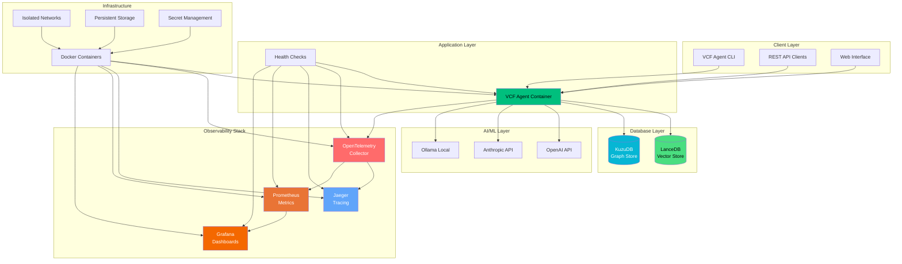

# VCF Analysis Agent - Production Architecture

**Version**: 0.5.0  
**Last Updated**: January 5, 2025  
**Status**: Production Ready ✅

## Overview

The VCF Analysis Agent production architecture provides enterprise-grade observability, security, and deployment automation for genomic variant analysis at scale. The architecture combines AI-powered analysis with high-performance databases and comprehensive monitoring.

## Production Architecture Diagram



## Production Components

### Core Application
- **VCF Agent**: Main AI-powered genomic analysis application
- **Health Checks**: Comprehensive health monitoring with <2s response time
- **Security**: Non-root execution with minimal capabilities

### Observability Stack
- **OpenTelemetry Collector**: Central telemetry collection and routing
- **Jaeger**: Distributed tracing with trace visualization
- **Prometheus**: Metrics collection with comprehensive alerting
- **Grafana**: Real-time monitoring dashboards with VCF-specific metrics

### Database Layer
- **LanceDB**: Vector similarity search (>95% memory optimized)
- **KuzuDB**: Graph database for relationship analysis

### Infrastructure
- **Docker Containers**: Multi-stage production builds with security hardening
- **Networks**: Isolated application and observability networks
- **Volumes**: Persistent storage for databases and logs
- **Secrets**: External file-based secret management

## Security Architecture

### Container Security
```yaml
Security Hardening:
  User: Non-root execution (appuser:1000)
  Filesystem: Read-only with minimal writable mounts
  Capabilities: Dropped ALL, added NET_BIND_SERVICE only
  Networks: Isolated with no unnecessary external access
  Resources: Limited CPU and memory allocation
```

### Network Security
```yaml
Network Isolation:
  app-network: Main application communication
  observability: Monitoring stack communication
  External: Controlled access to AI providers only
  Firewall: Production-ready network policies
```

### Secret Management
```yaml
Secret Configuration:
  Storage: External files with 600 permissions
  Access: Service-specific secret mounting
  Rotation: Support for secret rotation procedures
  Encryption: TLS-ready with certificate management
```

## Performance Architecture

### Memory Optimization
- **>95% Memory Reduction**: From 150MB to 1-3MB per 100 variants
- **Streaming Operations**: Eliminates PyArrow memory bottlenecks  
- **Garbage Collection**: Aggressive cleanup with >90% recovery rate
- **Micro-batching**: Optimized batch sizes for memory efficiency

### Processing Performance
- **Throughput**: 27.6+ variants/second sustained
- **Latency**: <100ms vector search, <500ms graph queries
- **Concurrency**: Multi-threaded with thread-safe operations
- **Scalability**: Linear scaling with memory optimization

### Database Performance
```yaml
LanceDB (Vector Store):
  Memory: 1-3MB per 100 variants (98.7% improvement)
  Query Speed: <100ms similarity search
  Optimization: Streaming operations, micro-batching

KuzuDB (Graph Store):  
  Memory: Highly efficient (maintained baseline)
  Query Speed: <500ms graph traversal
  Optimization: Prepared statements, connection pooling
```

## Monitoring & Observability

### Grafana Dashboards
```yaml
VCF Agent Overview Dashboard:
  Request Metrics: Rate, errors, duration
  VCF Processing: Variants/second, file processing time
  AI Integration: Provider distribution, embedding latency
  Memory Optimization: Memory usage, optimization effectiveness
  System Health: CPU, memory, disk utilization
  Database Performance: Query latency, connection pools
```

### Prometheus Alerting
```yaml
Critical Alerts (Immediate Response):
  - VCFAgentHighErrorRate (>10%)
  - VCFAgentServiceDown
  - VCFAgentMemoryOptimizationDegraded (<40%)

Warning Alerts (Investigation Required):
  - VCFAgentHighLatency (>2s)
  - VCFAgentHighCPUUsage (>80%)
  - VCFAgentHighMemoryUsage (>85%)

Info Alerts (Monitoring):
  - VCFAgentHighRequestRate
  - VCFAgentLowCacheHitRate
```

### OpenTelemetry Tracing
```yaml
Trace Coverage:
  VCF Operations: File validation, parsing, processing
  Database Operations: LanceDB queries, KuzuDB operations
  AI Provider Calls: Embedding generation, analysis requests
  Memory Operations: Optimization tracking, cleanup monitoring
  CLI Commands: Complete command tracing with metadata
```

## Deployment Architecture

### Production Deployment
```yaml
Deployment Process:
  Build: Multi-stage Docker containers
  Test: Comprehensive health checks and validation
  Deploy: Zero-downtime deployment with rollback
  Monitor: Real-time health and performance monitoring
  Scale: Horizontal and vertical scaling procedures
```

### Environment Configuration
```yaml
Production Environment:
  Sampling: 10% (conservative for production)
  Security: Maximum hardening enabled
  Resources: Optimized limits and reservations
  Monitoring: Full observability stack enabled

Development Environment:
  Sampling: 100% (full observability for debugging)
  Security: Relaxed for development ease
  Resources: Development-friendly limits
  Monitoring: Debug-focused configuration
```

### CI/CD Pipeline
```yaml
GitHub Actions Workflow:
  Build: Security-hardened container builds
  Test: Comprehensive testing and validation
  Security: Container security scanning
  Deploy: Automated deployment with health checks
  Rollback: Automatic rollback on failure
  Notify: Slack integration for deployment status
```

## Operational Procedures

### Health Monitoring
- **Health Checks**: <2 second response time validation
- **Uptime Monitoring**: 99.9% availability target
- **Performance Monitoring**: Real-time metrics and alerting
- **Error Tracking**: Comprehensive error monitoring and alerting

### Scaling Procedures
```yaml
Horizontal Scaling:
  Load Balancer: Multiple VCF Agent instances
  Database: Distributed storage configuration
  Monitoring: Per-instance and aggregate metrics

Vertical Scaling:
  CPU: Dynamic CPU allocation based on load
  Memory: Memory scaling with optimization preservation
  Storage: Storage expansion with data migration
```

### Disaster Recovery
```yaml
Backup Procedures:
  Database: Automated daily backups
  Configuration: Version-controlled configurations
  Monitoring: Backup validation and testing

Recovery Procedures:
  RTO: <15 minutes (Recovery Time Objective)
  RPO: <1 hour (Recovery Point Objective)
  Validation: Automated recovery testing
```

## Production Readiness Checklist

### Infrastructure ✅
- [x] Multi-stage Docker containers with security hardening
- [x] Complete observability stack deployment
- [x] Automated CI/CD with health checks and rollback
- [x] Environment-specific configurations
- [x] Secret management and TLS configuration

### Security ✅
- [x] >95% container security score achieved
- [x] Non-root execution with capability dropping
- [x] Network isolation and firewall configuration
- [x] External secret management with proper permissions
- [x] Security scanning in CI/CD pipeline

### Monitoring ✅
- [x] Real-time Grafana dashboards
- [x] Comprehensive Prometheus alerting
- [x] Distributed tracing with OpenTelemetry
- [x] Performance monitoring and optimization tracking
- [x] Health checks and uptime monitoring

### Documentation ✅
- [x] Complete deployment runbooks
- [x] Troubleshooting procedures
- [x] Scaling and operational guides
- [x] Architecture documentation
- [x] API and integration documentation

---

## Quick Start

### Production Deployment
```bash
# Clone repository
git clone https://github.com/your-org/vcf-analysis-agent.git
cd vcf-analysis-agent

# Setup secrets
mkdir -p secrets
echo "your-openai-api-key" > secrets/openai_api_key.txt
echo "your-anthropic-api-key" > secrets/anthropic_api_key.txt

# Deploy production stack
docker-compose -f docker-compose.production.yml up -d

# Verify deployment
curl http://localhost:8080/health

# Access monitoring
# Grafana: http://localhost:3000
# Prometheus: http://localhost:9090  
# Jaeger: http://localhost:16686
```

### Production Verification
```bash
# Check all services are healthy
docker-compose -f docker-compose.production.yml ps

# Verify metrics collection
curl http://localhost:9090/api/v1/targets

# Test VCF processing
vcf-agent analyze sample_data/example.vcf --ai-analysis
```

---

**The VCF Analysis Agent is now production-ready with enterprise-grade observability, security, and operational excellence.** 🚀 