# VCF Analysis Agent Tools Guide

**Last Updated**: May 29, 2025  
**Status**: Production Ready ✅  
**Tools Available**: 15+ specialized tools for genomic analysis

## Overview

The VCF Analysis Agent provides a comprehensive suite of specialized tools for genomic analysis, from VCF validation to AI-powered insights and database operations. This guide provides detailed documentation for all available tools.

## Tool Categories

### Core Tools Architecture

```mermaid
graph TD
    TOOLS[🛠️ VCF Agent Tools] --> VALIDATION[📋 Validation Tools]
    TOOLS --> BCFTOOLS[🔧 BCFtools Suite]
    TOOLS --> AI_TOOLS[🤖 AI Analysis Tools]
    TOOLS --> DATA_TOOLS[🗄️ Data Management]
    
    VALIDATION --> VALIDATE[validate_vcf<br/>File validation]
    VALIDATION --> ECHO[echo<br/>System test]
    
    BCFTOOLS --> VIEW[bcftools_view_tool<br/>View & subset]
    BCFTOOLS --> QUERY[bcftools_query_tool<br/>Extract data]
    BCFTOOLS --> FILTER[bcftools_filter_tool<br/>Filter variants]
    BCFTOOLS --> NORM[bcftools_norm_tool<br/>Normalize]
    BCFTOOLS --> STATS[bcftools_stats_tool<br/>Statistics]
    BCFTOOLS --> ANNOTATE[bcftools_annotate_tool<br/>Annotations]
    
    AI_TOOLS --> SUMMARY[vcf_analysis_summary_tool<br/>AI analysis]
    AI_TOOLS --> COMPARE[ai_vcf_comparison_tool<br/>File comparison]
    
    DATA_TOOLS --> GRAPH_LOAD[load_vcf_into_graph_db_tool<br/>Graph database]
    DATA_TOOLS --> SEARCH[search_variants<br/>Similarity search]
    
    style TOOLS fill:#00bf7d,color:#000000
    style VALIDATION fill:#00b4c5,color:#000000
    style BCFTOOLS fill:#0073e6,color:#ffffff
    style AI_TOOLS fill:#2546f0,color:#ffffff
    style DATA_TOOLS fill:#5928ed,color:#ffffff
```



## 📋 Validation Tools

### 1. validate_vcf Tool

**Purpose**: Validates VCF file format and content integrity

**Usage**:
```python
# Basic validation
result = agent.validate_vcf("sample_data/example.vcf")
# → "✅ VCF file 'sample_data/example.vcf' is valid and passed all validation checks."

# Natural language
response = agent("Please validate my VCF file and check for any issues")
```

**Parameters**:
- `vcf_file` (str): Path to VCF file to validate

**Returns**: String with validation results or raises exception for invalid files

**Validation Checks**:
- File format compliance (VCF 4.0+)
- Header completeness and correctness
- Column structure validation
- Data type verification
- Required field presence

**Example Error Handling**:
```python
try:
    result = agent.validate_vcf("questionable_file.vcf")
    print(f"Valid: {result}")
except ValidationError as e:
    print(f"Validation failed: {e}")
    # Handle specific validation errors
```

### 2. echo Tool

**Purpose**: System connectivity and response testing

**Usage**:
```python
result = agent.echo("test message")
# → "Echo: test message"
```

**Parameters**:
- `message` (str): Message to echo back

**Returns**: String with "Echo: {message}"

## 🔧 BCFtools Suite

### 1. bcftools_view_tool

**Purpose**: View, subset, and filter VCF/BCF files

**Usage**:
```python
# View specific regions
result = agent.bcftools_view_tool(
    input_file="input.vcf",
    output_file="subset.vcf",
    regions="chr1:1000000-2000000"
)

# Include only specific samples
result = agent.bcftools_view_tool(
    input_file="multi_sample.vcf",
    output_file="single_sample.vcf",
    samples="SAMPLE_001"
)

# Apply filters during viewing
result = agent.bcftools_view_tool(
    input_file="input.vcf",
    output_file="high_qual.vcf",
    include_expression="QUAL>30"
)
```

**Parameters**:
- `input_file` (str): Input VCF/BCF file
- `output_file` (str, optional): Output file (stdout if not specified)
- `regions` (str, optional): Specific genomic regions to include
- `samples` (str, optional): Comma-separated list of samples
- `include_expression` (str, optional): Filter expression to include variants
- `exclude_expression` (str, optional): Filter expression to exclude variants

### 2. bcftools_query_tool

**Purpose**: Extract specific information from VCF files

**Usage**:
```python
# Extract basic variant information
result = agent.bcftools_query_tool(
    input_file="input.vcf",
    format_string="%CHROM\t%POS\t%REF\t%ALT\t%QUAL\n"
)

# Extract sample-specific information
result = agent.bcftools_query_tool(
    input_file="input.vcf",
    format_string="%CHROM\t%POS\t[%GT\t%DP]\n",
    samples="SAMPLE_001"
)

# Extract INFO fields
result = agent.bcftools_query_tool(
    input_file="annotated.vcf",
    format_string="%CHROM\t%POS\t%INFO/AC\t%INFO/AF\n"
)
```

**Parameters**:
- `input_file` (str): Input VCF file
- `format_string` (str): Output format specification
- `samples` (str, optional): Specific samples to query
- `regions` (str, optional): Specific regions to query

**Format String Examples**:
- `%CHROM` - Chromosome
- `%POS` - Position
- `%REF` - Reference allele
- `%ALT` - Alternate allele
- `%QUAL` - Quality score
- `%INFO/TAG` - INFO field value
- `[%GT]` - Genotype for all samples
- `[%DP]` - Depth for all samples

### 3. bcftools_filter_tool

**Purpose**: Filter variants based on expressions

**Usage**:
```python
# Filter high-quality variants
result = agent.bcftools_filter_tool(
    input_file="input.vcf",
    output_file="filtered.vcf",
    include_expression="QUAL>30 && DP>10"
)

# Complex filtering with multiple conditions
result = agent.bcftools_filter_tool(
    input_file="input.vcf",
    output_file="stringent.vcf",
    include_expression="QUAL>50 && DP>20 && AF>0.01",
    exclude_expression="FILTER!='PASS'"
)

# Filter by genomic regions
result = agent.bcftools_filter_tool(
    input_file="input.vcf",
    output_file="chr1_filtered.vcf",
    regions="chr1",
    include_expression="QUAL>20"
)
```

**Parameters**:
- `input_file` (str): Input VCF file
- `output_file` (str): Output filtered VCF file
- `include_expression` (str, optional): Include variants matching expression
- `exclude_expression` (str, optional): Exclude variants matching expression
- `regions` (str, optional): Filter specific genomic regions

**Expression Examples**:
- `QUAL>30` - Quality score greater than 30
- `DP>10` - Depth greater than 10
- `AF>0.05` - Allele frequency greater than 5%
- `TYPE="snp"` - Only SNPs
- `FILTER="PASS"` - Only passed variants

### 4. bcftools_norm_tool

**Purpose**: Normalize variants (left-align, split multiallelic)

**Usage**:
```python
# Basic normalization
result = agent.bcftools_norm_tool(
    input_file="input.vcf",
    output_file="normalized.vcf",
    reference_fasta="reference.fa"
)

# Split multiallelic variants
result = agent.bcftools_norm_tool(
    input_file="multiallelic.vcf",
    output_file="split.vcf",
    reference_fasta="reference.fa",
    multiallelics="split"
)

# Remove duplicates
result = agent.bcftools_norm_tool(
    input_file="duplicated.vcf",
    output_file="deduplicated.vcf",
    reference_fasta="reference.fa",
    rm_dup="all"
)
```

**Parameters**:
- `input_file` (str): Input VCF file
- `output_file` (str): Output normalized VCF file
- `reference_fasta` (str): Reference genome FASTA file
- `multiallelics` (str, optional): Handle multiallelic variants ("split", "join")
- `rm_dup` (str, optional): Remove duplicates ("snps", "indels", "all")

### 5. bcftools_stats_tool

**Purpose**: Generate comprehensive VCF statistics

**Usage**:
```python
# Basic statistics
stats = agent.bcftools_stats_tool("input.vcf")
print("VCF Statistics:")
print(stats)

# Statistics for specific regions
stats = agent.bcftools_stats_tool(
    input_file="input.vcf",
    regions="chr1,chr2,chr3"
)

# Statistics with custom output
stats = agent.bcftools_stats_tool(
    input_file="input.vcf",
    output_file="stats_report.txt"
)
```

**Parameters**:
- `input_file` (str): Input VCF file
- `output_file` (str, optional): Output statistics file
- `regions` (str, optional): Specific regions to analyze
- `samples` (str, optional): Specific samples to analyze

**Statistics Generated**:
- Summary numbers (variants, samples, etc.)
- Variant type distribution (SNPs, indels)
- Quality score distributions
- Allele frequency spectrums
- Ti/Tv ratios
- Sample-specific statistics

### 6. bcftools_annotate_tool

**Purpose**: Add or modify annotations in VCF files

**Usage**:
```python
# Add annotations from another VCF
result = agent.bcftools_annotate_tool(
    input_file="input.vcf",
    output_file="annotated.vcf",
    annotations_file="annotations.vcf",
    columns="INFO/AC,INFO/AF"
)

# Remove specific annotations
result = agent.bcftools_annotate_tool(
    input_file="over_annotated.vcf",
    output_file="clean.vcf",
    remove="INFO/OLD_TAG,FORMAT/OLD_FORMAT"
)

# Add annotations from tab-delimited file
result = agent.bcftools_annotate_tool(
    input_file="input.vcf",
    output_file="annotated.vcf",
    annotations_file="annotations.tab",
    columns="CHROM,POS,REF,ALT,INFO/NEW_TAG",
    header_lines="annotations_header.txt"
)
```

**Parameters**:
- `input_file` (str): Input VCF file
- `output_file` (str): Output annotated VCF file
- `annotations_file` (str, optional): File with annotations
- `columns` (str, optional): Columns to transfer/add
- `remove` (str, optional): Annotations to remove
- `header_lines` (str, optional): Header definitions file

## 🤖 AI Analysis Tools

### 1. vcf_analysis_summary_tool

**Purpose**: AI-powered comprehensive variant analysis

**Usage**:
```python
# Clinical analysis
analysis = agent.vcf_analysis_summary_tool(
    vcf_file="patient.vcf",
    analysis_type="clinical"
)
print("Clinical Analysis:")
print(analysis)

# Pathogenicity-focused analysis
pathogenicity = agent.vcf_analysis_summary_tool(
    vcf_file="variants.vcf",
    analysis_type="pathogenicity"
)
print("Pathogenicity Assessment:")
print(pathogenicity)

# Quality assessment
quality = agent.vcf_analysis_summary_tool(
    vcf_file="raw_variants.vcf", 
    analysis_type="quality"
)
print("Quality Assessment:")
print(quality)

# General analysis
general = agent.vcf_analysis_summary_tool(
    vcf_file="sample.vcf"
)
```

**Parameters**:
- `vcf_file` (str): Path to VCF file to analyze
- `analysis_type` (str, optional): Type of analysis ("clinical", "pathogenicity", "quality", "general")

**Analysis Types**:
- **Clinical**: Focus on clinical significance, disease associations
- **Pathogenicity**: Detailed pathogenicity assessment and interpretation
- **Quality**: Quality metrics, filtering recommendations
- **General**: Comprehensive overview of variants and characteristics

**Output**: Detailed text analysis with:
- Variant summary statistics
- Clinical significance assessment
- Quality metrics evaluation
- Recommendations for further analysis
- Key findings and insights

### 2. ai_vcf_comparison_tool

**Purpose**: AI-powered comparison of two VCF files

**Usage**:
```python
# Compare for quality differences
comparison = agent.ai_vcf_comparison_tool(
    vcf_file1="before.vcf",
    vcf_file2="after.vcf",
    focus="quality_differences"
)
print("Quality Comparison:")
print(comparison)

# Compare for clinical significance
comparison = agent.ai_vcf_comparison_tool(
    vcf_file1="baseline.vcf",
    vcf_file2="treated.vcf",
    focus="clinical_significance"
)
print("Clinical Significance Changes:")
print(comparison)

# General comparison
comparison = agent.ai_vcf_comparison_tool(
    vcf_file1="sample1.vcf",
    vcf_file2="sample2.vcf"
)
```

**Parameters**:
- `vcf_file1` (str): First VCF file to compare
- `vcf_file2` (str): Second VCF file to compare  
- `focus` (str, optional): Comparison focus ("quality_differences", "clinical_significance", "variant_overlap")

**Comparison Focuses**:
- **quality_differences**: Quality metrics comparison
- **clinical_significance**: Clinical impact comparison
- **variant_overlap**: Variant presence/absence analysis
- **general**: Comprehensive comparison

**Output**: Detailed comparison analysis with:
- Variant overlap statistics
- Quality differences summary
- Clinical significance changes
- Unique variants in each file
- Recommendations and insights

## 🗄️ Data Management Tools

### 1. load_vcf_into_graph_db_tool

**Purpose**: Load VCF data into graph database for relationship analysis

**Usage**:
```python
# Load single sample
result = agent.load_vcf_into_graph_db_tool(
    vcf_file="patient.vcf",
    sample_id="PATIENT_001"
)
print(f"Graph loading result: {result}")

# Load with custom database path
result = agent.load_vcf_into_graph_db_tool(
    vcf_file="variants.vcf",
    sample_id="RESEARCH_SAMPLE_001",
    database_path="./custom_kuzu_db"
)

# Load multiple samples
samples = [
    ("patient1.vcf", "PATIENT_001"),
    ("patient2.vcf", "PATIENT_002"),
    ("patient3.vcf", "PATIENT_003")
]

for vcf_file, sample_id in samples:
    result = agent.load_vcf_into_graph_db_tool(
        vcf_file=vcf_file,
        sample_id=sample_id
    )
    print(f"Loaded {sample_id}: {result}")
```

**Parameters**:
- `vcf_file` (str): Path to VCF file to load
- `sample_id` (str): Unique identifier for the sample
- `database_path` (str, optional): Custom path to Kuzu database

**Graph Structure Created**:
- **Sample nodes**: Sample metadata and identifiers
- **Variant nodes**: Individual variant information
- **Gene nodes**: Gene information and relationships
- **Relationships**: has_variant, affects_gene, similar_to

**Output**: Status message indicating success/failure and statistics:
- Number of variants loaded
- Number of relationships created
- Database size information
- Any warnings or errors

### 2. search_variants Tool

**Purpose**: Search for similar variants in vector database

**Usage**:
```python
# Text-based similarity search
results = manager.search_variants(
    query="pathogenic variant in BRCA1",
    search_type="hybrid",
    limit=10
)
print("Similar variants found:")
for result in results:
    print(f"- {result}")

# Metadata filtering
filtered_results = manager.search_variants(
    query="high quality variant",
    search_type="metadata",
    filters={"quality_score": ">30", "chromosome": "1"},
    limit=15
)

# Vector similarity search
vector_results = manager.search_variants(
    query="missense mutation pathogenic",
    search_type="vector",
    limit=5
)
```

**Parameters**:
- `query` (str): Search query text
- `search_type` (str): Type of search ("vector", "metadata", "hybrid")
- `limit` (int, optional): Maximum number of results
- `filters` (dict, optional): Additional metadata filters

**Search Types**:
- **vector**: Semantic similarity using embeddings
- **metadata**: Filter-based search on variant properties
- **hybrid**: Combination of vector and metadata search

**Output**: List of matching variants with:
- Similarity scores
- Variant details (chromosome, position, alleles)
- Clinical significance information
- Quality metrics

## Tool Integration Patterns

### Workflow Chaining

```python
def comprehensive_vcf_pipeline(vcf_file: str, sample_id: str):
    """Example of chaining multiple tools"""
    
    # Step 1: Validation
    try:
        validation = agent.validate_vcf(vcf_file)
        print(f"✅ Validation: {validation}")
    except Exception as e:
        print(f"❌ Validation failed: {e}")
        return
    
    # Step 2: Quality filtering
    filtered_file = f"filtered_{vcf_file}"
    filter_result = agent.bcftools_filter_tool(
        input_file=vcf_file,
        output_file=filtered_file,
        include_expression="QUAL>30 && DP>10"
    )
    print(f"✅ Filtering: {filter_result}")
    
    # Step 3: Normalization
    normalized_file = f"norm_{filtered_file}"
    norm_result = agent.bcftools_norm_tool(
        input_file=filtered_file,
        output_file=normalized_file,
        reference_fasta="reference.fa"
    )
    print(f"✅ Normalization: {norm_result}")
    
    # Step 4: AI Analysis
    analysis = agent.vcf_analysis_summary_tool(
        vcf_file=normalized_file,
        analysis_type="clinical"
    )
    print(f"✅ AI Analysis completed")
    
    # Step 5: Database loading
    db_result = agent.load_vcf_into_graph_db_tool(
        vcf_file=normalized_file,
        sample_id=sample_id
    )
    print(f"✅ Database loading: {db_result}")
    
    return {
        "validation": validation,
        "filtering": filter_result,
        "normalization": norm_result,
        "analysis": analysis,
        "database": db_result
    }

# Execute pipeline
results = comprehensive_vcf_pipeline("patient.vcf", "PATIENT_001")
```

### Error Handling Best Practices

```python
def robust_tool_execution(tool_func, *args, **kwargs):
    """Wrapper for robust tool execution with retries"""
    max_retries = 3
    
    for attempt in range(max_retries):
        try:
            result = tool_func(*args, **kwargs)
            return result
        except FileNotFoundError as e:
            print(f"File not found: {e}")
            return None
        except PermissionError as e:
            print(f"Permission denied: {e}")
            return None
        except Exception as e:
            print(f"Attempt {attempt + 1} failed: {e}")
            if attempt < max_retries - 1:
                time.sleep(2 ** attempt)  # Exponential backoff
            else:
                print("All attempts failed")
                return None

# Usage
result = robust_tool_execution(
    agent.bcftools_stats_tool,
    "large_file.vcf"
)
```

## Performance Considerations

### Tool Performance Guidelines

| Tool Category | Typical Performance | Memory Usage | Recommendations |
|---------------|-------------------|--------------|-----------------|
| **Validation** | ~50ms per file | Low | Use for all files |
| **BCFtools** | Variable by operation | Medium | Use filtering for large files |
| **AI Analysis** | ~2-10s per file | Medium-High | Consider batch processing |
| **Graph Loading** | ~1-5s per 1K variants | Medium | Monitor database size |

### Optimization Tips

1. **Use filtering early**: Filter variants before expensive operations
2. **Batch processing**: Group multiple operations when possible
3. **Memory monitoring**: Watch memory usage with large files
4. **Parallel execution**: Use parallel processing for independent operations
5. **Caching**: Leverage caching for repeated operations

## Links and References

- [Usage Examples](USAGE_EXAMPLES.md)
- [Architecture Guide](ARCHITECTURE_GUIDE.md)
- [Memory Optimization Features](MEMORY_OPTIMIZATION_FEATURES.md)
- [Production Monitoring](PRODUCTION_MONITORING.md)
- [Developer Guide](DEVELOPER_GUIDE.md)

---

**Next Steps**: Explore specific usage examples for advanced tool combinations and workflow optimization. 