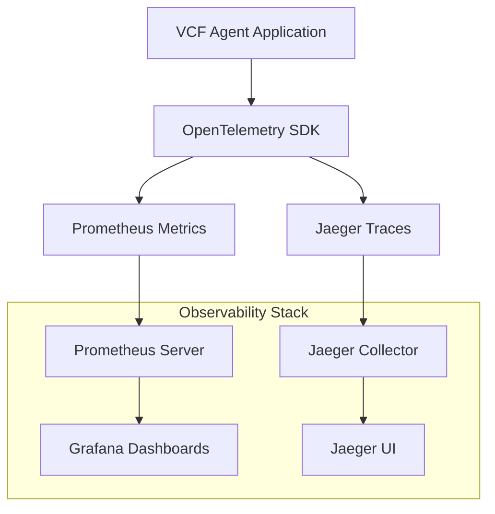

# Observability Stack

The VCF Analysis Agent includes a comprehensive observability stack that provides monitoring, metrics collection, distributed tracing, and visualization capabilities. This stack consists of:

- **OpenTelemetry (OTel)**: Distributed tracing and metrics collection
- **Prometheus**: Metrics storage and querying
- **Grafana**: Metrics visualization and dashboards
- **Jaeger**: Distributed trace visualization and analysis

## Overview

The observability stack is designed to provide insights into:
- AI interaction performance and success rates
- VCF processing operations and tool usage
- System performance and resource utilization
- Error tracking and debugging information

## Architecture



## Configuration Examples

This section provides complete configuration examples that you can use to set up the observability stack for the VCF Analysis Agent.

### Docker Compose Configuration

The complete Docker Compose setup includes all observability components:

```{literalinclude} _static/examples/docker-compose.yml
:language: yaml
:caption: docker-compose.yml - Complete observability stack setup
```

**Download**: {download}`docker-compose.yml <_static/examples/docker-compose.yml>`

### Prometheus Configuration

The Prometheus configuration defines how metrics are scraped from the VCF Agent:

```{literalinclude} _static/examples/prometheus.yml
:language: yaml
:caption: prometheus.yml - Prometheus scraping configuration
```

**Download**: {download}`prometheus.yml <_static/examples/prometheus.yml>`

Key configuration points:
- **Scrape interval**: 15 seconds for real-time monitoring
- **VCF Agent target**: `host.docker.internal:8000/metrics`
- **Job name**: `vcf_agent` for easy identification

### Grafana Dashboard Configuration

The AI Interactions dashboard provides comprehensive monitoring of AI-related operations:

**Download**: {download}`AI Interactions Dashboard JSON <_static/examples/ai_interactions_dashboard.json>`

This dashboard includes:
- **AI Request Rate**: Requests per second by model provider and task
- **AI P95 Response Time**: 95th percentile response times
- **AI Error Rate**: Error rates by type and tool

To import this dashboard:
1. Open Grafana (http://localhost:3000)
2. Navigate to Dashboards → Import
3. Upload the downloaded JSON file
4. Configure the Prometheus data source if prompted

## OpenTelemetry Integration

### Tracing Setup

The VCF Analysis Agent uses OpenTelemetry for distributed tracing. Tracing is configured in `src/vcf_agent/tracing.py`:

**Key Features:**
- Automatic instrumentation for HTTP requests and logging
- Custom spans for AI interactions and tool operations
- Trace context propagation across async operations
- Integration with structured logging

**Environment Variables:**
- `OTEL_EXPORTER_OTLP_TRACES_ENDPOINT`: Jaeger collector endpoint (default: `http://localhost:4317`)
- `OTEL_SERVICE_NAME`: Service name for traces (default: `vcf-analysis-agent`)

### Metrics Collection

OpenTelemetry metrics are configured alongside Prometheus client metrics:

**Instrumented Operations:**
- CLI command execution
- Agent interactions and responses
- Tool invocations (VCF validation, bcftools operations)
- Error tracking and categorization

## Prometheus Metrics

### Metrics Endpoint

The VCF Analysis Agent exposes Prometheus metrics on port 8000 at the `/metrics` endpoint:

```
http://localhost:8000/metrics
```

### Available Metrics

#### AI Interaction Metrics
- `vcf_agent_ai_requests_total`: Total number of AI requests (counter)
  - Labels: `model_provider`, `endpoint_task`, `status`
- `vcf_agent_ai_response_seconds`: AI response time (histogram)
  - Labels: `model_provider`, `endpoint_task`, `status`
- `vcf_agent_ai_tokens_total`: Total tokens processed (e.g., prompt + completion) by the AI agent (counter)
  - Labels: `model_provider`, `endpoint_task`, `token_type`, `status`
- `vcf_agent_ai_errors_total`: Total errors by type during AI model interactions (counter)
  - Labels: `model_provider`, `endpoint_task`, `error_type`

#### Tool Usage Metrics
- `vcf_agent_tool_requests_total`: Total tool invocations (counter)
  - Labels: `tool_name`, `status`
- `vcf_agent_tool_duration_seconds`: Duration of agent tool execution in seconds (histogram)
  - Labels: `tool_name`, `status`
- `vcf_agent_tool_errors_total`: Total errors during agent tool execution (counter)
  - Labels: `tool_name`, `error_type`

#### BCFTools Integration Metrics
- `vcf_agent_bcftools_commands_total`: Total bcftools command executions (counter)
  - Labels: `bcftools_subcommand`, `status`
- `vcf_agent_bcftools_duration_seconds`: Duration of bcftools subprocess calls in seconds (histogram)
  - Labels: `bcftools_subcommand`, `status`
- `vcf_agent_bcftools_errors_total`: Total errors from bcftools invocations (non-zero return codes) (counter)
  - Labels: `bcftools_subcommand`

#### System Metrics
- Standard Prometheus client metrics (process CPU, memory, etc.)

### Metrics Configuration

Metrics are configured in `src/vcf_agent/metrics.py` with two registries:
- **HTTP Registry**: For scraping by Prometheus
- **Push Registry**: For CLI operations (pushes to Pushgateway when configured)

## Grafana Dashboards

### Accessing Grafana

Grafana is available at `http://localhost:3000` when running via Docker Compose.

**Default Credentials:**
- Username: `admin`
- Password: `admin`

### AI Interactions Dashboard

The "AI Interactions" dashboard provides insights into AI performance:

**Panels:**
1. **AI Request Rate**: Requests per second over time
2. **AI P95 Response Time**: 95th percentile response times
3. **AI Error Rate**: Percentage of failed requests

**Queries:**
- Request Rate: `rate(vcf_agent_ai_requests_total[5m])`
- P95 Response Time: `histogram_quantile(0.95, rate(vcf_agent_ai_response_duration_seconds_bucket[5m]))`
- Error Rate: `rate(vcf_agent_ai_requests_total{status="error"}[5m]) / rate(vcf_agent_ai_requests_total[5m]) * 100`

### Dashboard Configuration

The dashboard JSON is available at `config/grafana/dashboards/ai_interactions_dashboard.json` and can be imported into Grafana.

## Jaeger Tracing

### Accessing Jaeger

Jaeger UI is available at `http://localhost:16686` when running via Docker Compose.

### Trace Exploration Patterns

#### Common Search Patterns

1. **AI Interaction Traces**
   - Service: `vcf-analysis-agent`
   - Operation: `cli.agent_ask_interaction`
   - Look for child spans: `tool.*` operations

2. **VCF Processing Traces**
   - Service: `vcf-analysis-agent`
   - Operation: `tool.validate_vcf`
   - Tags: `vcf.file_path`, `tool.status`

3. **Error Investigation**
   - Search by tags: `error=true`
   - Filter by status: `error`
   - Look for spans with error annotations

#### Trace Structure

Typical trace hierarchy:
```
cli.agent_ask_interaction
├── tool.validate_vcf
│   └── bcftools.stats (if applicable)
├── agent.llm_call
└── response.formatting
```

### Trace Context in Logs

Structured logs include OpenTelemetry trace context:
```json
{
  "timestamp": "2025-05-26T10:30:00Z",
  "level": "INFO",
  "message": "Processing VCF file",
  "trace_id": "abc123...",
  "span_id": "def456...",
  "vcf_file": "sample.vcf.gz"
}
```

## Docker Compose Setup

### Starting the Observability Stack

```bash
docker-compose up -d
```

This starts:
- **Prometheus**: Port 9090
- **Grafana**: Port 3000  
- **Jaeger**: Ports 16686 (UI), 4317 (OTLP), 14268 (HTTP)

### Service Configuration

#### Prometheus Configuration

Located at `prometheus.yml`:
```yaml
global:
  scrape_interval: 15s

scrape_configs:
  - job_name: 'vcf_agent'
    static_configs:
      - targets: ['host.docker.internal:8000']
```

#### Grafana Data Source

Prometheus is configured as a data source at `http://prometheus:9090` within the Docker network.

## Development and Debugging

### Adding Custom Metrics

To add new Prometheus metrics:

1. Define the metric in `src/vcf_agent/metrics.py`:
```python
MY_CUSTOM_COUNTER = Counter(
    'vcf_agent_custom_operations_total',
    'Description of custom operations',
    ['label1', 'label2']
)
```

2. Instrument your code:
```python
from vcf_agent.metrics import MY_CUSTOM_COUNTER

MY_CUSTOM_COUNTER.labels(label1='value1', label2='value2').inc()
```

### Adding Custom Traces

To add OpenTelemetry spans:

1. Import the tracer:
```python
from vcf_agent.tracing import get_tracer

tracer = get_tracer(__name__)
```

2. Create spans:
```python
with tracer.start_as_current_span("my_operation") as span:
    span.set_attribute("operation.type", "custom")
    # Your code here
```

### Local Development

For local development without Docker:

1. **Prometheus**: Download and run locally, update `prometheus.yml` targets
2. **Jaeger**: Use Jaeger all-in-one Docker image
3. **Grafana**: Run locally or use Docker with volume mounts

### Troubleshooting

#### Common Issues

1. **No metrics in Prometheus**
   - Check if metrics endpoint is accessible: `curl http://localhost:8000/metrics`
   - Verify Prometheus scrape targets in UI
   - Check Docker network connectivity

2. **Missing traces in Jaeger**
   - Verify OTLP endpoint configuration
   - Check trace sampling settings
   - Ensure spans are properly flushed

3. **Grafana dashboard shows no data**
   - Verify Prometheus data source configuration
   - Check query syntax and metric names
   - Confirm time range settings

#### Debugging Commands

```bash
# Check metrics endpoint
curl http://localhost:8000/metrics

# Check Prometheus targets
curl http://localhost:9090/api/v1/targets

# Check Jaeger health
curl http://localhost:14269/
```

## Performance Considerations

### Metrics Collection

- Metrics collection has minimal performance impact
- HTTP endpoint is non-blocking
- Consider metric cardinality (avoid high-cardinality labels)

### Tracing Overhead

- Tracing adds minimal latency (microseconds per span)
- Sampling can be configured to reduce overhead
- Async operations are properly instrumented

### Resource Usage

- Prometheus: ~50MB RAM for typical workloads
- Jaeger: ~100MB RAM for collector and UI
- Grafana: ~100MB RAM for basic dashboards

## Security Considerations

### Network Security

- Observability services run on localhost by default
- Production deployments should use proper authentication
- Consider network segmentation for observability stack

### Data Privacy

- Traces and metrics may contain sensitive information
- Configure retention policies appropriately
- Avoid logging sensitive data in span attributes

### Access Control

- Grafana supports multiple authentication methods
- Jaeger UI should be protected in production
- Prometheus metrics endpoint should be secured if exposed

## Best Practices

### Metrics

1. Use consistent naming conventions
2. Include relevant labels but avoid high cardinality
3. Document metric meanings and usage
4. Monitor metric collection performance

### Tracing

1. Create meaningful span names and attributes
2. Propagate context across service boundaries
3. Use structured logging with trace context
4. Sample appropriately for production workloads

### Dashboards

1. Focus on actionable metrics
2. Use appropriate time ranges and aggregations
3. Include error rates and latency percentiles
4. Document dashboard purpose and usage

### Alerting

Consider setting up alerts for:
- High error rates in AI interactions
- Elevated response times
- System resource exhaustion
- Service availability issues 